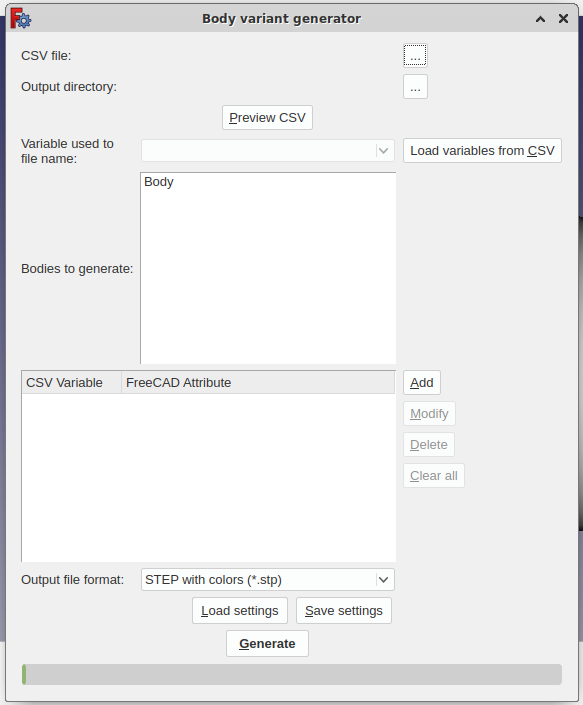

# Variant Generator for [FreeCAD](https://www.freecadweb.org/)

This Workbench works with FreeCAD 0.18 and above.
Workbench generates variants by values for CSV files from

[**PartDesign Body**](https://wiki.freecadweb.org/PartDesign_Body) 
or
[**Part**](https://wiki.freecadweb.org/Std_Part) 
and exports them to 3D CAD files supported by FreeCAD (e.g. STEP, VRML etc.)

## Installation

### Automatic installation

Use FreeCAD's built-in Addon-Manager. It requires a one-time setup and then updates seamlessly afterwards.

1. Start FreeCAD
2. Go to **Tools > Addon Manager**  
3. Click on the _Configure_ button in the top right corner
4. Select the checkbox to _Automatically check for updates at start_
5. Add the VariantGenerator Workbench GitHub repo address in to the _Custom repositories (one per line)_ text box:  
`https://github.com/archdvx/VariantGenerator`
6. Press **OK**
7. Restart FreeCAD

Result: You should see the VariantGenerator Workbench available in the Workbench drop-down menu.

### Manual installation

`git clone https://github.com/archdvx/VariantGenerator.git`

or [download](https://github.com/archdvx/VariantGenerator/archive/refs/heads/master.zip) and unzip

to

#### on Linux
~/.FreeCAD/Mod
#### on Windows
%APPDATA%\FreeCAD\Mod
#### on Mac
~/Library/Preferences/FreeCAD/Mod

## Changelog

v 1.00 - First public release

**Happy Generation** your 3D models.
